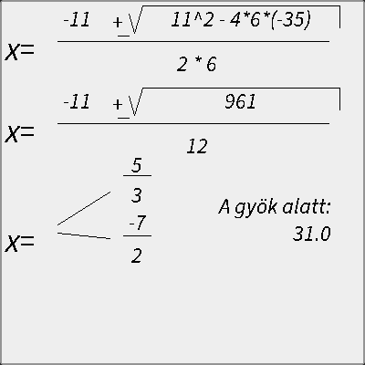

# historical-quadratic-solver

This is a quadratic equation solver I implemented in 2nd grade of high school, almost 20 years ago.
Originally it was running on a J2ME phone - on a [Nokia 6230](https://en.wikipedia.org/wiki/Nokia_6230),
to be exact.

The main purpose was to make my life easier during boring math classes -
it worked, as I was never asked to solve any of these equations again after a week ;)

It took the 3 coefficients of a quadratic equation given in the form `a * x^2 + b * x + c = 0`,
then gave the results and some derivation steps visually, like the following:

This repository contains some source code that I restored from the [original listing](original-listing.pdf) 
I found accidentally in my parents' house. The differences are the following, mainly:

1. I removed the menu and the input boxes, the coefficients are being hardcoded now.
2. The project does not depend on J2ME anymore, but uses Java AWT to render.
3. Hence, I needed to reimplement some primitive J2ME graphics functionality like anchors for string output.

The whole code base is pretty much horrible,
but I think it worked fine for the purpose I made it almost 20 years ago! :)
